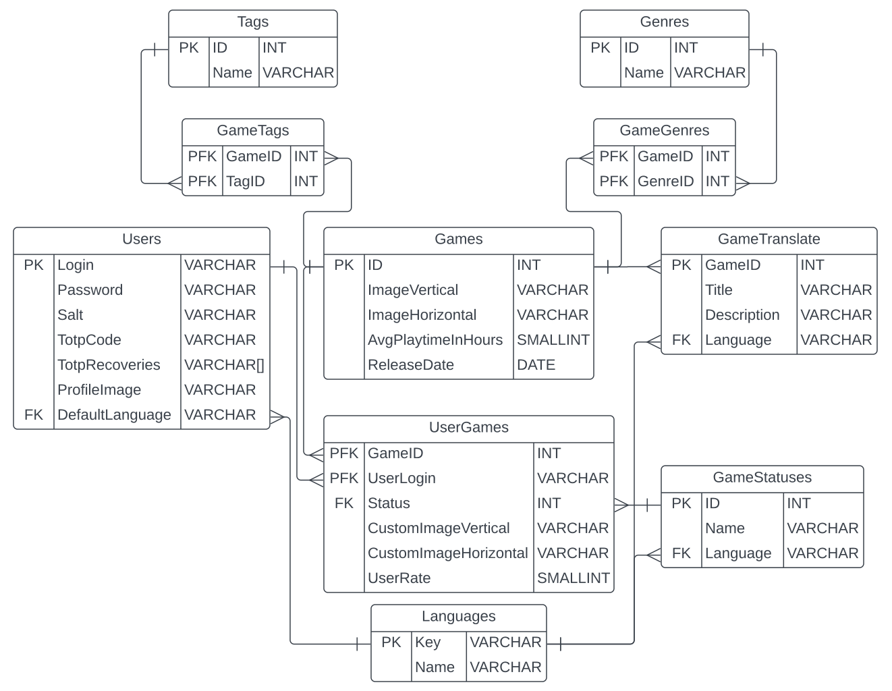

# **Game database project**

## Desctiption

**Game Database** is my pet project that allows you to create lists of games you've completed and are planning to complete, as well as leave a rating of the game. The project is being created for educational purposes and generally clones the concept of the rawg.io website.

## Database

I chose **PostgreSQL** as my database management system because it is a robust and scalable open source DBMS. In addition to its efficiency in processing large amounts of data, it complies with a large number of SQL standards, which makes it possible to quickly migrate the database to another DBMS if needed.

### ER-diagram



## Secrets configuration

To add database connection strings, JWT settings or API key just create **appsettings.Secrets.json** file in ./API directory, with the following content before building

### Database Connection string

To connect the application to the database, add following content to your secrets config before building the project: 

```json
{
  "ConnectionStrings": {
    "DefaultConnection": "Server=<HOST>; Port=<PORT>; Database=<DATABASE_NAME>; User Id=<USERNAME>; Password=<YOUR_PASSWORD>;"
  }
}
```

### API key

API authorization works by adding ***Authentication:ApiKey*** field to config:

```json
{
  "Authentication": {
    "ApiKey": "<YOUR_API_KEY>"
  }
}
```

### JWT key

JWT requires key to sign user tokens, so we basically need to add ***JwtSettings:Key*** field to **appsettings.Secrets.json** config:

```json
{
  "JwtSettings": {
    "Key": "<YOUR_JWT_SIGN_KEY>",
    "AuthTokenLifetimeInSeconds": <SECONDS_LIFETIME>,
    "RefreshTokenLifetimeInDays": <DAYS_LIFETIME>
  }
}
```

*This description will be updated as the project develops.*
